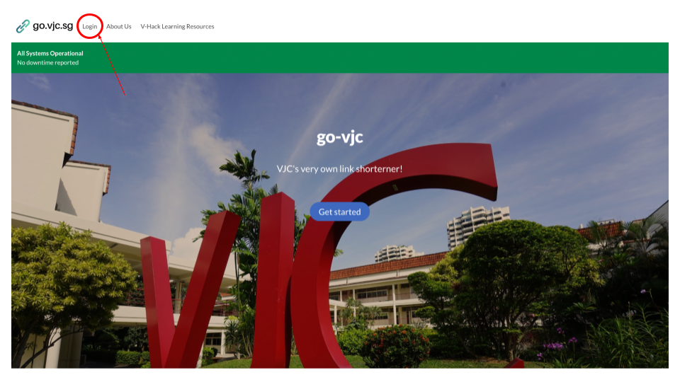
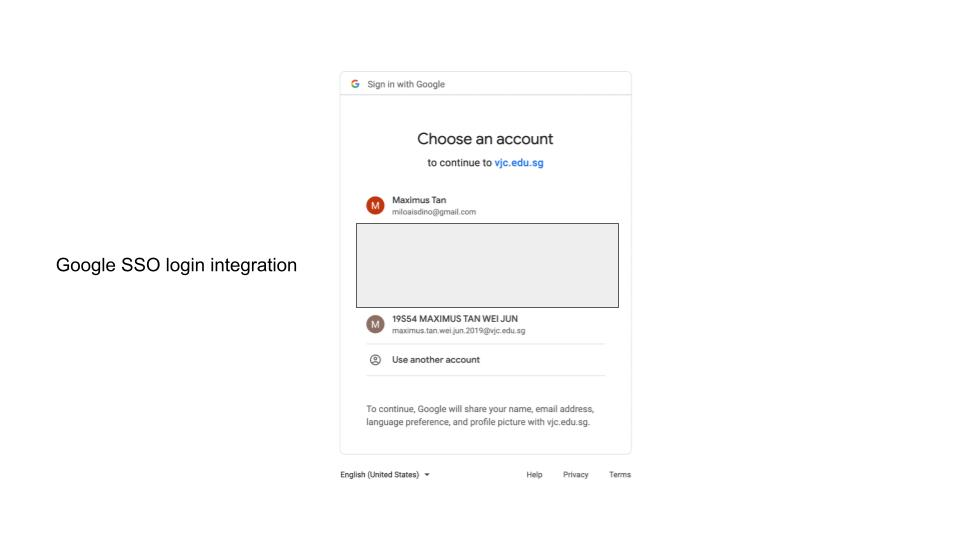
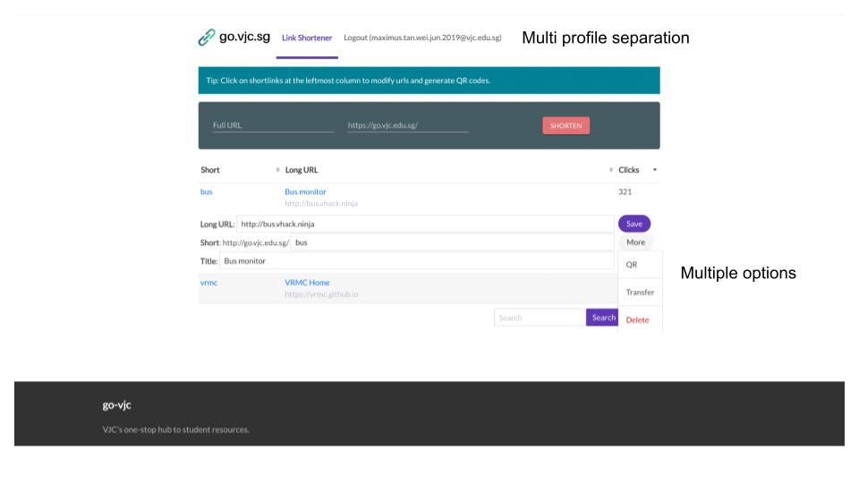

# go.vjc.sg - link shorterning service

[Visit Site](https://go.vjc.sg/)  
  
This is a school-wide portal I built based on the yourls open source project entailing
- Sole contributor and maintainer of the go.vjc.sg codebase (apart from already opensourced projects)
- Frontend redesign using the Singapore Government Design System (sgds) ui framework
- Backend self-coded customisation to include Google SSO and added functionalities, eg Transfer ownership, QR code generation
- Bugfixes and server maintainence
  
## Screenshots

