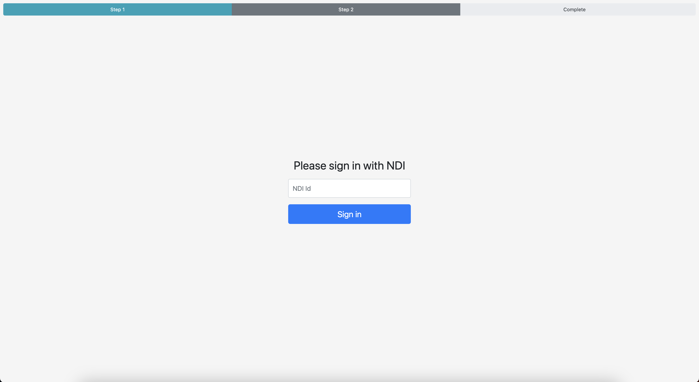
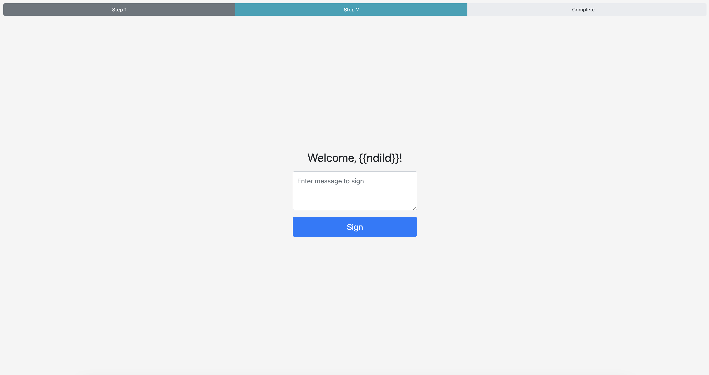
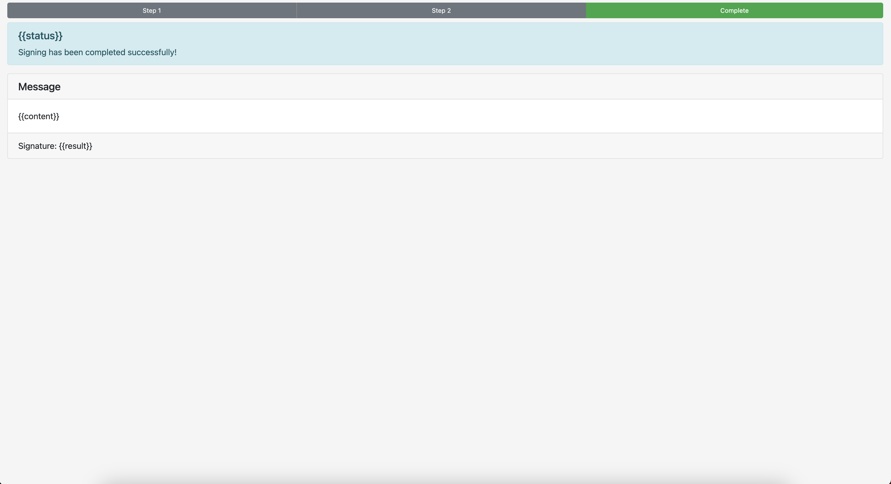
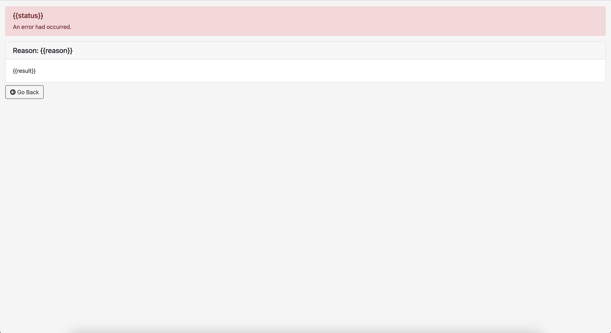

# ndipoc
Proof-of-Concept to demonstrate sign-in and digital signing using public-private key pairs

### To run:
node server.js

~~### Install mobile app~~
~~> Please install/update the mobile app again, if you have create your test account before 1 Oct~~

~~For iOS: once downloaded, do trust the certificate from “Government Technology Agency” in your [Profiles & Device Management] setting.~~

## Notes:
Digital signing API on singpass is no longer accessible with the included set of credentials as they were test keys for the now closed public beta of the new Singpass (NDI)

## Screenshots:

